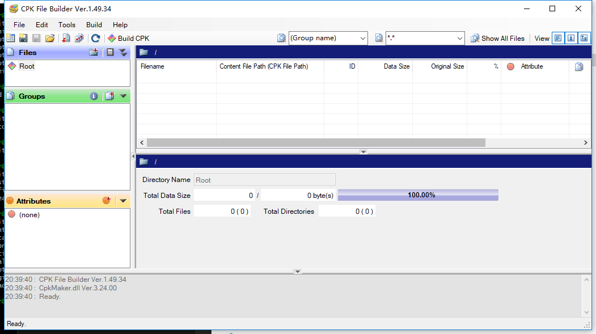
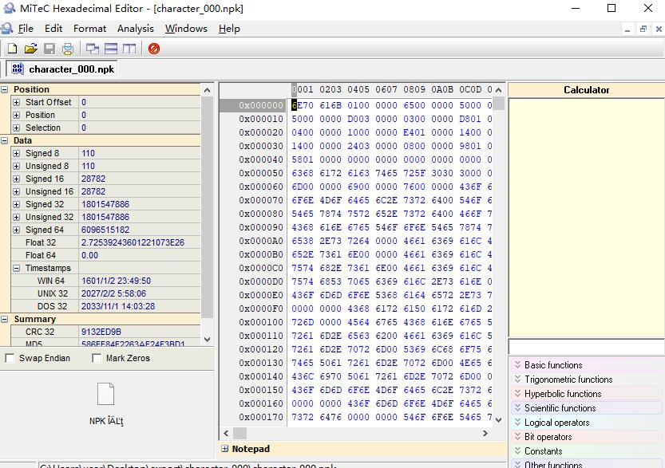
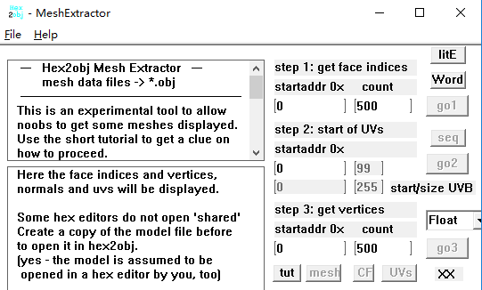

# 对端游《航海王-燃烧之血》的破解

主要是端游的端游资源的提取， 分别为网格mesh和纹理texture的获取.

环境：

```
python27
pillow (PIL)
```

使用命令安装pil:
```
pip install pillow
```


## steps:

#### step1.  解压.cpk 

使用CPK File Builder对cpk解压， 你将得到三种文件 .npk .npki .npkv

.npk  是各种资源的索引
.npki 是mesh的buffer
.npkv 是raw texture buffer

<br><br>


#### step2.  使用hex分析二进制文件 确认mesh中的vertiex&face的地址和数量

<br><br>


#### step3. 使用step2的参数输入到hex2obj中， 提取mesh

<br><br>


上面所用到的工具都可以在工程中的tool.zip中得到。 

如果你讨厌复杂的进制转换和公式计算， 你可以使用parse_model.py脚本

```py
# 进入你的工作目录
cd work_dir
# 给py传入参数xx是npk的文件名
python parse_model.py xx.npk
```

py将会生成一个文本文件， 会把step3使用的参数打印出来, 文本内容的格式如下:

``` c
mesh count: 107 

********* 0 **********
start: 2e60, end: 2f90
vertex addr: 000
face   addr: 1abe0
face   cnt: 5568
vertex cnt: 1141
FVF   addr: 16490
size   UVB: 16

********* 1 **********
start: 2fa0, end: 30c0
vertex addr: 1d760
face   addr: 1fce0
face   cnt: 540
vertex cnt: 109
FVF   addr: 1f970
size   UVB: 8

********* 2 **********
start: 30d0, end: 31f0
vertex addr: 2120
face   addr: 226a0
face   cnt: 540
vertex cnt: 109
FVF   addr: 22330
size   UVB: 8

```


#### step4. 导出纹理

python传入前两个参数即npk和npkv文件路径， 第三个参数是输出路径

``` py 
# 进入你的工作目录
cd work_dir
# 导出
python parse_texture.py \
 /Users/penghuailiang/Documents/projects/tools/character_000.npk \
 /Users/penghuailiang/Documents/projects/tools/character_000.npkv \
 /Users/penghuailiang/Documents/projects/tools/out/ 
```


更多的信息请点击[这里][i1]。


## Contacts:
	email: 		peng_huailiang@qq.com
	website: 	https://huailiang.github.io


[i1]: https://huailiang.github.io/blog/2019/reverse/